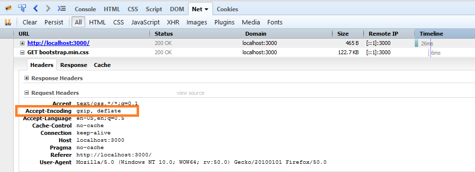
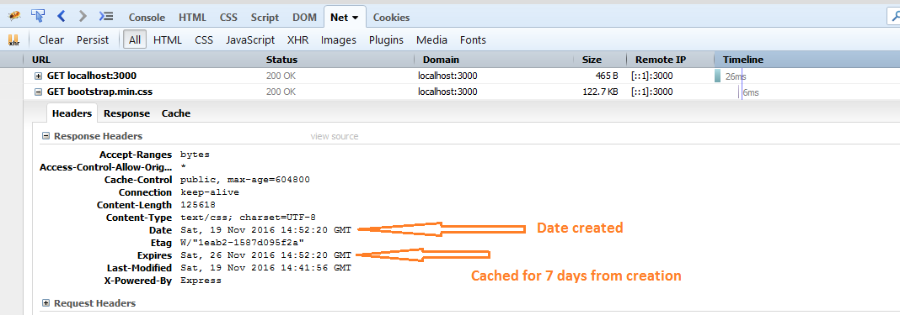

# Demo API

```
npm i
npm start
```

## Feature

- CRUD api http://localhost:5000/posts enabled with CORS
- UI Dashboard: http://localhost:5000/dashboard for creating api in seconds
- Gzipping enabled ( serving gzip)



- Server side caching




## REST API

Dashboard: http://localhost:5000/dashboard

http://localhost:5000/posts

## Heroku App

https://hesing.herokuapp.com/posts

## Heroku Deploy

```
git add --all
git commit -m "1st commit"


heroku login
heroko create
heroku git:remote -a <app-name created in last step>
git push heroku master
```